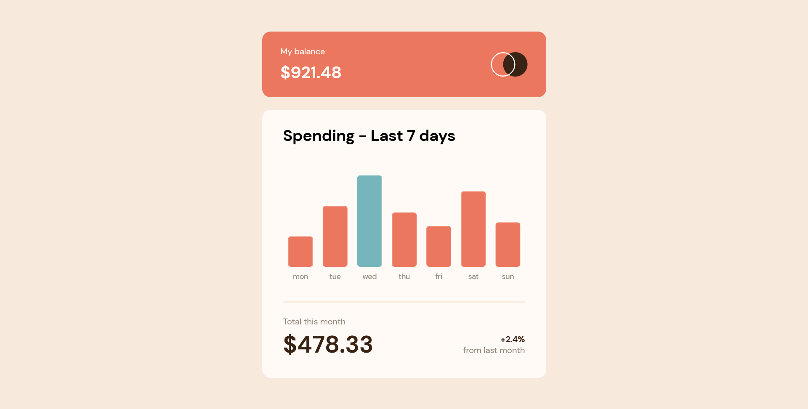

# Frontend Mentor - Expenses chart component solution

This is a solution to the [Expenses chart component challenge on Frontend Mentor](https://www.frontendmentor.io/challenges/expenses-chart-component-e7yJBUdjwt). Frontend Mentor challenges help you improve your coding skills by building realistic projects. 

## Table of contents

- [Overview](#overview)
  - [The challenge](#the-challenge)
  - [Screenshot](#screenshot)
  - [Links](#links)
- [My process](#my-process)
  - [Built with](#built-with)
  - [What I learned](#what-i-learned)
  - [Continued development](#continued-development)
  - [Useful resources](#useful-resources)
- [Author](#author)
- [Acknowledgments](#acknowledgments)

**Note: Delete this note and update the table of contents based on what sections you keep.**

## Overview

### The challenge

Users should be able to:

- View the bar chart and hover over the individual bars to see the correct amounts for each day
- See the current day’s bar highlighted in a different colour to the other bars
- View the optimal layout for the content depending on their device’s screen size
- See hover states for all interactive elements on the page
- **Bonus**: Use the JSON data file provided to dynamically size the bars on the chart

### Screenshot

### Links

- Live Site URL: [Add live site URL here](https:/expenseschartbyade.vercel.app)

## My process

### Built with

- Semantic HTML5 markup
- SASS
- Flexbox
- [Chart.js](https://chartjs.org/) - JS Charting Library

### What I learned

I really had the opportunity to experience data visualization via bar charts for the first time and I was able to learn a lot and code according to the design. This project taught me resilience as I didn't have any previous experience with chart JS.

### Continued development

In future projects I want to attempt advanced DOM manipulation.

**Note: Delete this note and the content within this section and replace with your own plans for continued development.**

### Useful resources

- [Stackoverflow](https://www.stackoverflow.com) - This helped with some features that I needed due to the fact that I had no prior experience with Charts.
- [Chart JS](https://www.chartjs.org/docs/latest/samples/information.html) - The Chart JS samples section helped me feel at home despite the fact that I was using new technology.

**Note: Delete this note and replace the list above with resources that helped you during the challenge. These could come in handy for anyone viewing your solution or for yourself when you look back on this project in the future.**

## Author
- Frontend Mentor - [@adex-hub](https://www.frontendmentor.io/profile/adex-hub)

Remember after this dev session delete both of those images 